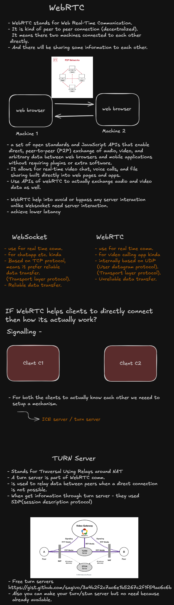

## Use local peerjs server
``` cmd
npm install peer -g

peerjs --port 9000 --path /myapp
```



## Free turn server to use in own project
- Also you can make your turn/stun server but no need because already available
https://gist.github.com/sagivo/3a4b2f2c7ac6e1b5267c2f1f59ac6c6b