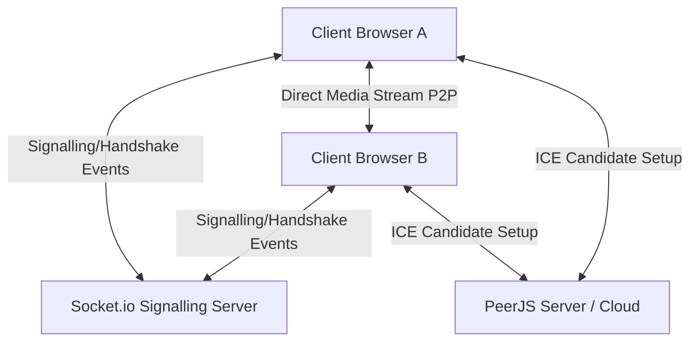

# OrbitMeet - WebRTC P2P Video Conferencing

OrbitMeet is a premium, ultra-low latency peer-to-peer video conferencing application built with **React**, **TypeScript**, **Tailwind CSS (V4)**, **DaisyUI**, **Socket.io**, and **PeerJS (WebRTC)**. 

OrbitMeet allows users to create instant, secure video call rooms and communicate directly peer-to-peer, keeping media transmission fast, direct, and private.

---

## 🚀 Key Features

*   **Direct P2P HD Video & Audio**: Media streams travel directly between browsers, eliminating server bottlenecks and ensuring real-time quality.
*   **Adaptive Google Meet-Style Grid**: A responsive grid layout that dynamically scales and reshapes video cards depending on active connection counts.
*   **Device Track Toggles**: Interactive, glassmorphic buttons in a bottom toolbar to toggle microphone and camera devices.
*   **Smart Track Release & Reset**: Instantly stops webcam/microphone tracks and releases browser hardware locks when clicking "Leave Meeting", ensuring the browser recording dot is shut down immediately.
*   **Seamless Cloud Fallback**: Automatically attempts to connect to a local PeerJS server first. If the local server is offline, it gracefully falls back to the **PeerJS Free Cloud Server** to ensure it "just works" out-of-the-box.
*   **Real-Time Diagnostics Sidebar**: Displays active socket connection ID, PeerJS ID, connection states, and quick-copy utilities for Room Code and Invitation Links.
*   **Premium Dark UI**: Implements a customized dark interface leveraging DaisyUI's `night` theme, HSL gradients, and modern Google Fonts (`Plus Jakarta Sans` and `Outfit`).

---

## 🛠️ Project Architecture



1.  **Signalling Server**: Node.js/Express with Socket.io handles room handshakes, joining notifications, and active participant logging.
2.  **WebRTC Peer Channel**: PeerJS manages ICE candidates, answers/calls, and media track streams.
3.  **Client UI**: Vite + React 19 + TypeScript provides reactive controls, a styled grid, and state synchronization.

---

## 📦 Directory Structure

*   `server/`: TypeScript signalling server handling WebRTC socket coordination.
*   `client/frontend/`: React Vite client with context management, custom players, and pages.

---

## 🏃 Quick Start Guide

### 1. Start Signalling Server
Navigate to the server directory, install dependencies, and start the development server:
```bash
cd server
npm install
npm run dev
```
*The server will run on port `3000` by default.*

### 2. Start Client Frontend
Navigate to the client directory, install dependencies, and start the Vite client:
```bash
cd client/frontend
npm install
npm run dev
```
*The frontend will run on port `5173`. Open [http://localhost:5173](http://localhost:5173) in your browser.*

### 3. Start PeerJS Server (Optional)
To use a local PeerJS signalling broker, install and run it globally:
```bash
npm install peer -g
peerjs --port 9000 --path /myapp
```
*Note: If this server is not running, OrbitMeet will automatically fall back to the global PeerJS Cloud Server.*

---

## 📝 Usage Details

1.  **Creating a Room**: Click **Create Room** on the Home page. It will automatically redirect you to a new room with a unique UUID.
2.  **Inviting Others**: Copy the invite URL by clicking **Copy Invite Link** at the top right, or copy the raw Room Code from the diagnostics sidebar.
3.  **Joining a Room**: Paste a Room Code into the **Join Meeting** input field on the home page and click join.
4.  **Leaving a Room**: Click **Leave Meeting** to release your camera, reset all context states, and return safely to the home dashboard.